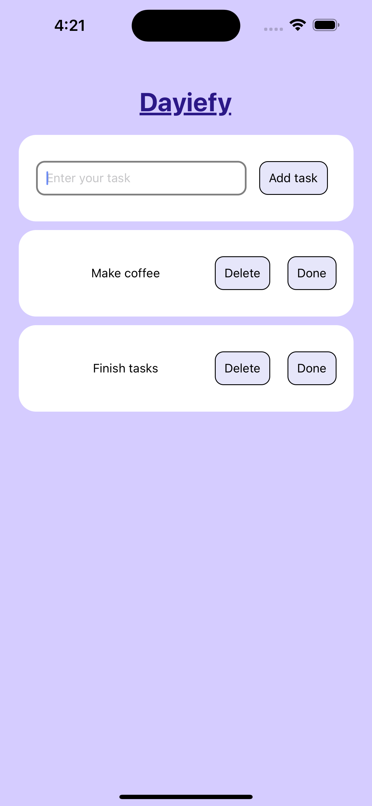

# Dayiefy

This is a simple Todo app built using React Native.

## Features

- Add tasks to your todo list.
- Mark tasks as complete.
- Delete tasks from the list.

## Installation

Make sure you have Node.js and npm installed on your machine. Then, clone this repository and run the following commands:

```bash
cd Dayiefy
npm install
```
## Usage

To start the app, run:

```bash
npm start
```
This will open the Metro Bundler in your default web browser. You can then choose to run the app on an iOS or Android simulator, or on a physical device by following the instructions provided.


## Screenshots  
  


